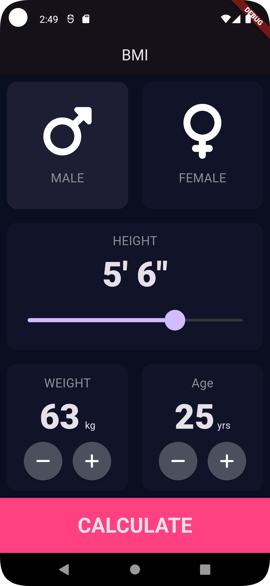
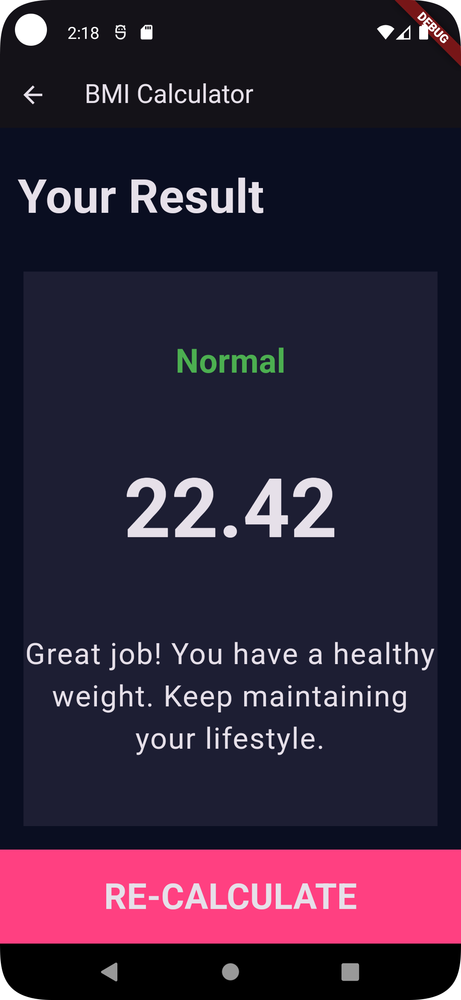

# 🏋️‍♂️ BMI Calculator - Flutter App
## USING FLUTTER & DART

**BMI Calculator** is a sleek and simple Flutter app that calculates your **Body Mass Index (BMI)**, 🌱

📱 Features
🧑‍🤝‍🧑 Gender Selection: Choose between Male and Female to personalize the calculation.
📏 Height: Conveniently use the slider to select your height in (ft. inch).
⚖️ Weight Input: Enter your weight weight using simple and intuitive increase/decrease buttons.
🎂 Age Input: By tapping the button select your age.
📊 BMI Calculation: Get your BMI result along with a clear breakdown of your BMI category (e.g., Underweight, Normal weight, Overweight, Obese).
🔁 Recalculate: Easily revisit the input page to make adjustments and recalculate your BMI.


---------------------------------------------------------------------------------------------------
## App Screenshots

<p align="center">
  
  
  
  
</p>


## FILE STRUCTURE
```plaintext
├── lib/
│   ├── components/
│   │   ├── buttom_button.dart     # Custom button widget for the app
│   │   ├── icon_content.dart      # Contains the icon and label layout for gender selection
│   │   ├── reusable_card.dart     # A reusable container widget for displaying content
│   │   └── round_icon_button.dart # A custom button with rounded edges for weight and age control
│   │
│   ├── calculator_brain.dart      # Contains the logic for calculating BMI
│   ├── constants.dart             # Defines constant values like colors, text styles, etc.
│   ├── main.dart                  # Entry point of the Flutter application
│   └── screens/
│       ├── input_page.dart        # The main input page for entering data (weight, height, etc.)
│       └── results_page.dart      # The results page that displays the calculated BMI and category
│
├── .gitignore                   # Files and directories to ignore when pushing to GitHub
├── LICENSE                      # The license file for your project (e.g., MIT)
└── README.md                    # The README file with project description and setup instructions


---------------------------------------------------------------------------------------


## Getting Started

To get started with the BMI Calculator Flutter app on your local machine, follow these instructions:

### Prerequisites

- Install Flutter SDK: [Flutter installation guide](https://flutter.dev/docs/get-started/install)
- A compatible IDE (Android Studio, VS Code, etc.)
- A connected device or emulator to run the app

### Installation

1. Clone the repository:

   ```bash
   git clone https://github.com/ezabyss/bmi_calculator.git
   cd bmi_calculator
   flutter pub get
   flutter run
   


*Crafted with Flutter by [Ez Abyss](https://github.com/ezabyss)*
